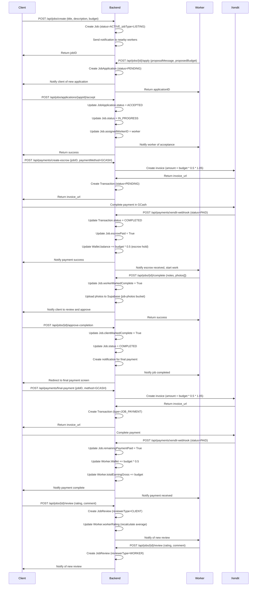
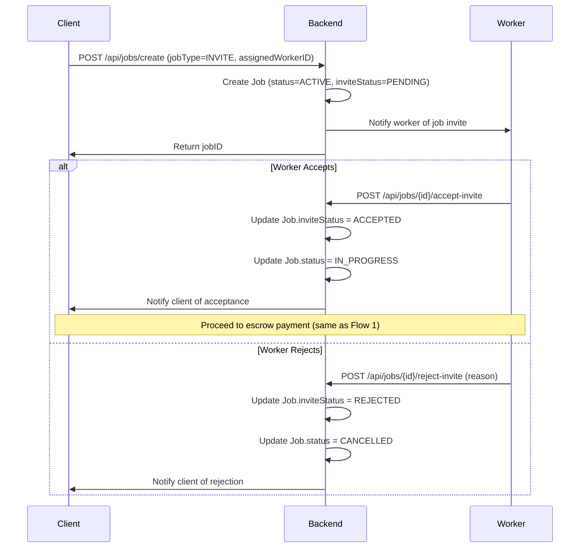
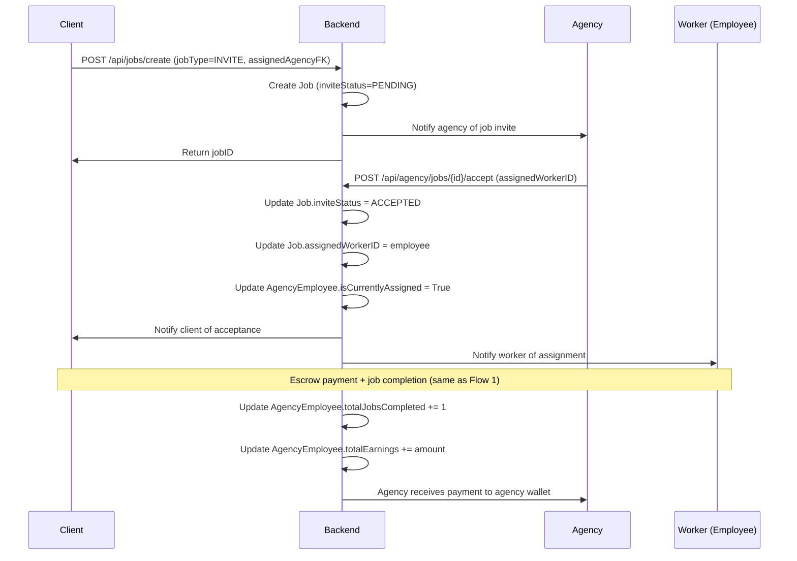
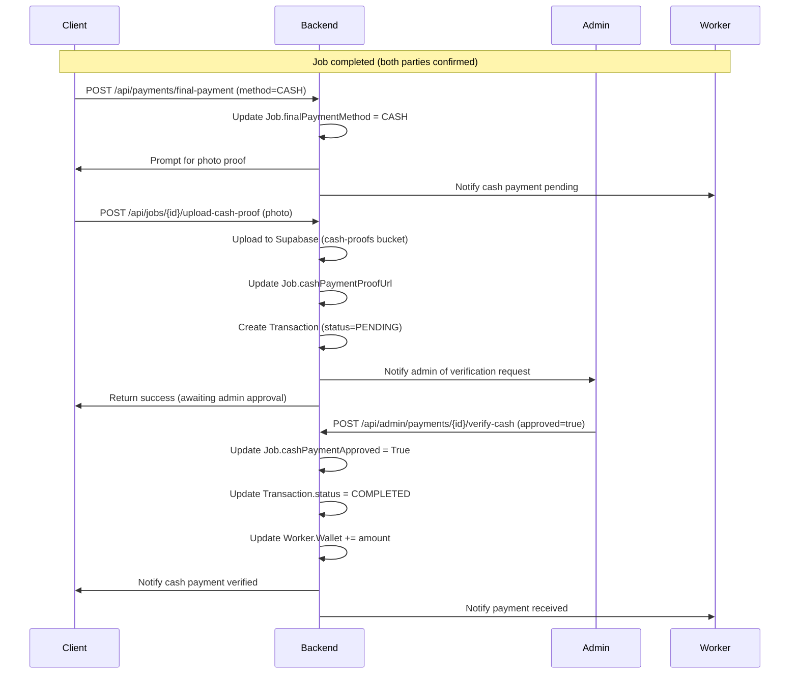
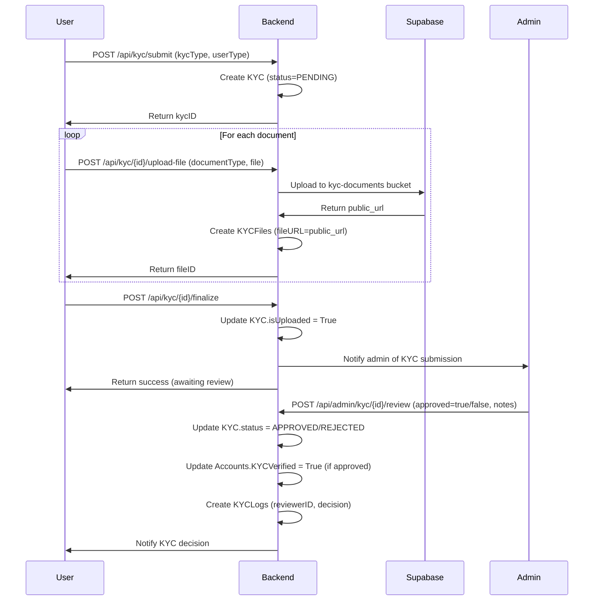
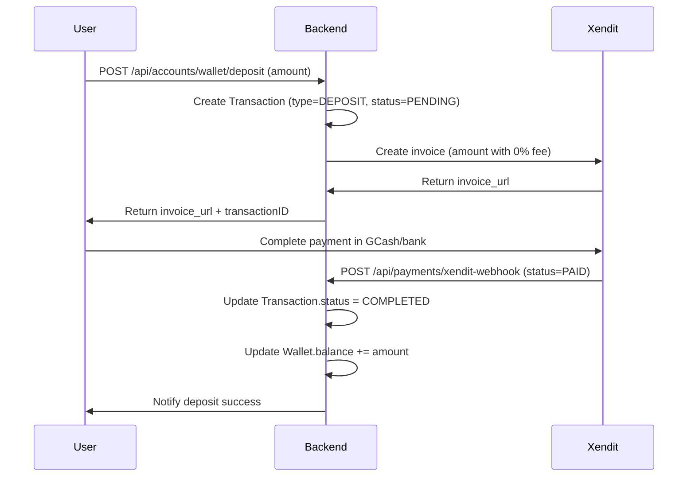
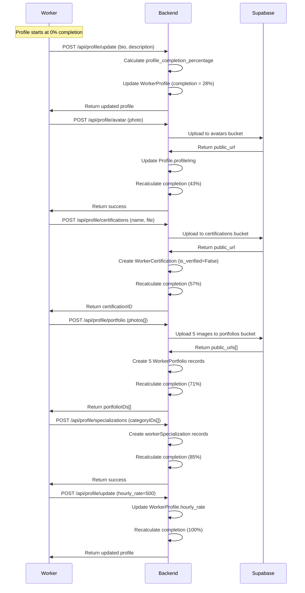
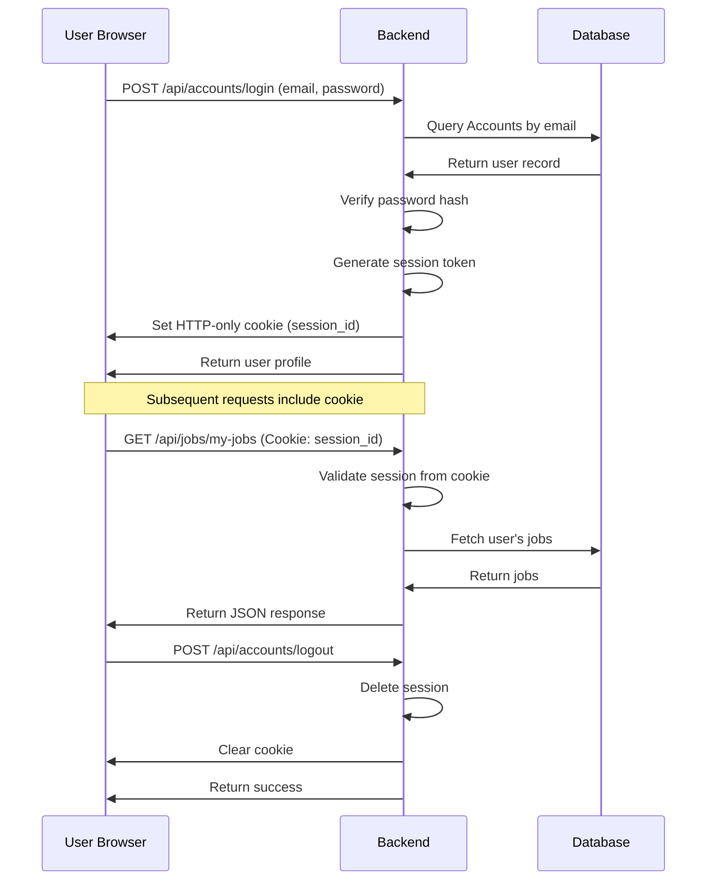
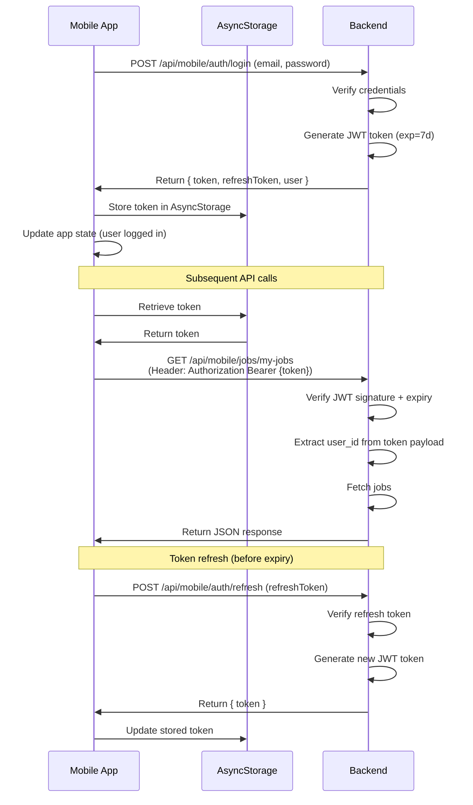

# iAyos Integration Points & Business Flows

**Generated**: November 20, 2025  
**Purpose**: Document integration points, external services, and complete business logic flows

---

## 🔌 External Integrations

### 1. Xendit Payment Gateway

**Purpose**: Payment processing (GCash, bank transfers, invoices)  
**API Version**: 7.0.0 (xendit-python package)  
**Configuration**: `settings.py` - `XENDIT_API_KEY` from env

**Integration Points**:

```python
# Backend: src/accounts/services.py
from xendit import Invoice, Disbursement

# Create payment invoice (50% escrow downpayment)
invoice = Invoice.create(
    external_id=f"job-{job_id}-escrow",
    amount=int(escrow_amount * 105),  # +5% platform fee
    payer_email=client_email,
    description=f"Escrow payment for job {job_title}",
    success_redirect_url=f"{FRONTEND_URL}/payments/success",
    failure_redirect_url=f"{FRONTEND_URL}/payments/failed",
)

# Webhook endpoint
@router.post("/api/payments/xendit-webhook")
def handle_xendit_webhook(request: HttpRequest):
    # Verify webhook signature
    # Update Transaction.status to COMPLETED
    # Update Job.escrowPaid = True
    # Send notification to client and worker
```

**Mobile Integration**:

- Mobile app opens WebView with `invoice.invoice_url`
- User completes payment in GCash/bank app
- Xendit redirects to success/failure URL
- Mobile app detects redirect URL change and closes WebView
- App polls `/api/mobile/payments/status/{transactionID}` for status

**Web Integration**:

- Next.js creates Xendit invoice via `/api/payments/create-invoice`
- Redirects to `invoice.invoice_url`
- User completes payment
- Xendit webhook updates transaction status
- User redirected back to success page

---

### 2. Supabase File Storage

**Purpose**: File uploads (avatars, portfolios, KYC documents, job photos, cash proofs)  
**Configuration**: `settings.py` - `SUPABASE_URL`, `SUPABASE_KEY`, `SUPABASE_BUCKET`

**Buckets**:

- `avatars` - Profile images
- `portfolios` - Worker portfolio images
- `kyc-documents` - ID cards, business permits
- `job-photos` - Job before/after images
- `cash-proofs` - Cash payment verification photos
- `certifications` - Worker certification documents

**Upload Flow**:

```python
# Backend: src/accounts/services.py
from supabase import create_client

supabase = create_client(SUPABASE_URL, SUPABASE_KEY)

def upload_to_supabase(file, bucket_name, file_path):
    # Upload file
    response = supabase.storage.from_(bucket_name).upload(
        path=file_path,
        file=file,
        file_options={"content-type": file.content_type}
    )

    # Get public URL
    public_url = supabase.storage.from_(bucket_name).get_public_url(file_path)
    return public_url
```

**Mobile Upload**:

- Uses Expo ImagePicker to select image
- Compresses image if >2MB (target 1200x1200)
- Creates FormData with file blob
- POSTs to backend endpoint with multipart/form-data
- Backend uploads to Supabase and returns public URL
- Mobile stores URL in local state

---

### 3. Expo Push Notifications

**Purpose**: Push notifications for mobile app  
**Configuration**: `PushToken` model stores Expo push tokens

**Registration Flow**:

```typescript
// Mobile: app/_layout.tsx
import * as Notifications from "expo-notifications";

async function registerForPushNotifications() {
  const { status } = await Notifications.requestPermissionsAsync();
  if (status !== "granted") return;

  const token = (await Notifications.getExpoPushTokenAsync()).data;

  // Send to backend
  await apiRequest(ENDPOINTS.REGISTER_PUSH_TOKEN, {
    method: "POST",
    body: JSON.stringify({ token }),
  });
}
```

**Backend Sending**:

```python
# Backend: src/accounts/services.py
import requests

def send_push_notification(user_id, title, body, data=None):
    push_tokens = PushToken.objects.filter(accountFK__accountID=user_id)

    for token_obj in push_tokens:
        message = {
            "to": token_obj.token,
            "sound": "default",
            "title": title,
            "body": body,
            "data": data or {}
        }

        requests.post("https://exp.host/--/api/v2/push/send", json=message)
```

---

### 4. Django Channels WebSocket (Chat)

**Purpose**: Real-time messaging  
**Configuration**: `asgi.py` - WebSocket routing

**Connection Flow**:

```python
# Backend: src/profiles/consumers.py
from channels.generic.websocket import AsyncJsonWebsocketConsumer

class ChatConsumer(AsyncJsonWebsocketConsumer):
    async def connect(self):
        self.conversation_id = self.scope['url_route']['kwargs']['conversation_id']
        self.room_group_name = f'chat_{self.conversation_id}'

        # Join room group
        await self.channel_layer.group_add(self.room_group_name, self.channel_name)
        await self.accept()

    async def receive_json(self, content):
        message = content['message']
        sender_id = content['sender_id']

        # Save to database
        await self.save_message(message, sender_id)

        # Broadcast to group
        await self.channel_layer.group_send(
            self.room_group_name,
            {
                'type': 'chat_message',
                'message': message,
                'sender_id': sender_id,
            }
        )
```

**Web Client**:

```typescript
// Frontend Web: lib/websocket.ts
const ws = new WebSocket(`ws://localhost:8000/ws/chat/${conversationId}/`);

ws.onmessage = (event) => {
  const data = JSON.parse(event.data);
  setMessages((prev) => [...prev, data]);
};

ws.send(JSON.stringify({ message: "Hello", sender_id: userId }));
```

**Mobile Client**: Similar but uses native WebSocket from React Native

---

## 📊 Complete Business Flows

### Flow 1: Job Creation → Completion (LISTING Type)



**Key States**:

1. `ACTIVE` - Job open for applications
2. `IN_PROGRESS` - Worker accepted and escrow paid
3. `COMPLETED` - Both parties confirmed completion + final payment made

**Escrow Logic**:

- 50% downpayment held in platform wallet
- Released to worker after final payment confirmed
- 5% platform fee added to both payments

---

### Flow 2: Direct Worker Hire (INVITE Type)



**Differences from LISTING**:

- No application process
- Direct assignment to specific worker
- Worker can accept/reject invite
- If rejected, job cancelled (client can recreate)

---

### Flow 3: Agency Job Assignment



**Agency Payment Split**:

- Agency receives 100% of job payment
- Agency pays employee separately (outside platform)
- Platform tracks employee performance metrics

---

### Flow 4: Cash Payment with Admin Verification



**Admin Verification Required**:

- Photo proof must show cash handover or receipt
- Admin can reject if proof is insufficient
- If rejected, client must re-upload proof

---

### Flow 5: KYC Verification



**Document Requirements**:

**Individual**:

- Valid ID (2 images: front + back)
- Selfie with ID

**Agency**:

- Business permit
- SEC/DTI registration
- Owner's valid ID
- Agency profile photo

**Verification Timeframe**: 1-3 business days

---

### Flow 6: Wallet Deposit via Xendit



**Deposit Limits**:

- Minimum: ₱100
- Maximum: ₱100,000 per transaction
- Daily limit: ₱500,000

---

### Flow 7: Worker Profile Completion



**Completion Criteria** (7 fields × 14.3% each):

1. Bio (non-empty)
2. Description (non-empty)
3. Hourly rate (set)
4. Profile image (uploaded)
5. Specializations (at least 1)
6. Certifications (at least 1)
7. Portfolio (at least 1 image)

---

## 🔒 Authentication Flows

### Web Authentication (Cookie-based)



**Cookie Configuration**:

- `HttpOnly`: true
- `Secure`: true (production only)
- `SameSite`: Lax
- `Max-Age`: 7 days

---

### Mobile Authentication (JWT Bearer)



**JWT Payload**:

```json
{
  "user_id": 123,
  "email": "worker@example.com",
  "profile_type": "WORKER",
  "exp": 1700000000,
  "iat": 1699400000
}
```

**Token Expiry**:

- Access token: 7 days
- Refresh token: 30 days

---

## 🔔 Notification System

### Notification Triggers

| Event                   | Recipient      | Title                             | Body                                               |
| ----------------------- | -------------- | --------------------------------- | -------------------------------------------------- |
| Job Created             | Nearby workers | "New job in your area"            | "{category} job - ₱{budget}"                       |
| Application Received    | Client         | "New job application"             | "{workerName} applied to {jobTitle}"               |
| Application Accepted    | Worker         | "Application accepted!"           | "Your application for {jobTitle} was accepted"     |
| Application Rejected    | Worker         | "Application not selected"        | "Your application for {jobTitle} was not selected" |
| Escrow Paid             | Worker         | "Payment received"                | "Client paid ₱{amount} escrow for {jobTitle}"      |
| Job Completed by Worker | Client         | "Job completion pending approval" | "{workerName} marked {jobTitle} as complete"       |
| Job Approved by Client  | Worker         | "Job completed!"                  | "{clientName} approved completion of {jobTitle}"   |
| Final Payment Received  | Worker         | "Payment received"                | "You received ₱{amount} for {jobTitle}"            |
| Review Received         | Worker/Client  | "New review"                      | "{reviewerName} left you a {rating}-star review"   |
| KYC Approved            | User           | "KYC verified!"                   | "Your identity verification was approved"          |
| KYC Rejected            | User           | "KYC verification failed"         | "Please resubmit with correct documents"           |
| Wallet Deposit          | User           | "Deposit successful"              | "₱{amount} added to your wallet"                   |
| New Message             | User           | "New message"                     | "{senderName}: {messagePreview}"                   |

### Notification Channels

**In-App Notifications** (All users):

- Stored in `Notification` model
- Badge count displayed in app header
- Mark as read on view

**Push Notifications** (Mobile only):

- Sent via Expo Push Service
- Requires user permission + valid PushToken
- Opens relevant screen on tap

**Email Notifications** (Configurable):

- Sent via Resend API for critical events
- User can disable in NotificationSettings

---

## 📱 API Request Flow Examples

### Mobile: Create Job and Pay Escrow

```typescript
// 1. Create job
const jobResponse = await apiRequest(ENDPOINTS.CREATE_JOB, {
  method: "POST",
  body: JSON.stringify({
    title: "Fix leaking faucet",
    description: "Kitchen faucet leaking",
    categoryID: 5,
    budget: 1000,
    location: "Zamboanga City",
    urgency: "MEDIUM",
    jobType: "LISTING",
  }),
});

const { jobID } = jobResponse;

// 2. Create escrow payment
const escrowResponse = await apiRequest(ENDPOINTS.CREATE_ESCROW_PAYMENT, {
  method: "POST",
  body: JSON.stringify({
    jobID,
    paymentMethod: "GCASH",
  }),
});

const { invoiceURL, transactionID } = escrowResponse;

// 3. Open Xendit payment in WebView
navigation.navigate("PaymentWebView", { invoiceURL, transactionID });

// 4. Poll payment status (every 5 seconds)
const intervalId = setInterval(async () => {
  const status = await apiRequest(ENDPOINTS.PAYMENT_STATUS(transactionID));

  if (status.status === "COMPLETED") {
    clearInterval(intervalId);
    navigation.navigate("PaymentSuccess", { jobID });
  } else if (status.status === "FAILED") {
    clearInterval(intervalId);
    navigation.navigate("PaymentFailed", { transactionID });
  }
}, 5000);
```

---

### Web: Accept Job Application

```typescript
// components/ApplicationCard.tsx
const handleAccept = async (applicationId: number) => {
  try {
    // Accept application
    await fetch(`/api/jobs/applications/${applicationId}/accept`, {
      method: "POST",
      credentials: "include",
    });

    // Refresh job details
    router.refresh();

    toast.success("Worker assigned to job");

    // Redirect to escrow payment
    router.push(`/jobs/${jobId}/payment`);
  } catch (error) {
    toast.error("Failed to accept application");
  }
};
```

---

## 🚨 Error Handling Patterns

### Backend Error Responses

```python
# Consistent error response format
{
    "error": "Invalid credentials",
    "code": "AUTH_FAILED",
    "details": {
        "field": "password",
        "reason": "Password is incorrect"
    }
}
```

**HTTP Status Codes**:

- `200 OK` - Success
- `201 Created` - Resource created
- `400 Bad Request` - Validation error
- `401 Unauthorized` - Auth failed or missing
- `403 Forbidden` - Insufficient permissions
- `404 Not Found` - Resource not found
- `409 Conflict` - Duplicate resource
- `500 Internal Server Error` - Server error

### Frontend Error Handling

```typescript
// Mobile: lib/api/config.ts
async function apiRequest(endpoint: string, options: RequestInit = {}) {
  try {
    const token = await AsyncStorage.getItem("authToken");

    const response = await fetch(endpoint, {
      ...options,
      headers: {
        "Content-Type": "application/json",
        Authorization: `Bearer ${token}`,
        ...options.headers,
      },
    });

    if (!response.ok) {
      const error = await response.json();
      throw new Error(error.error || "Request failed");
    }

    return await response.json();
  } catch (error) {
    // Show toast notification
    showToast("error", error.message);
    throw error;
  }
}
```

---

**Last Updated**: November 20, 2025  
**Status**: ✅ Complete integration documentation  
**External Services**: Xendit, Supabase, Expo Push, Django Channels
